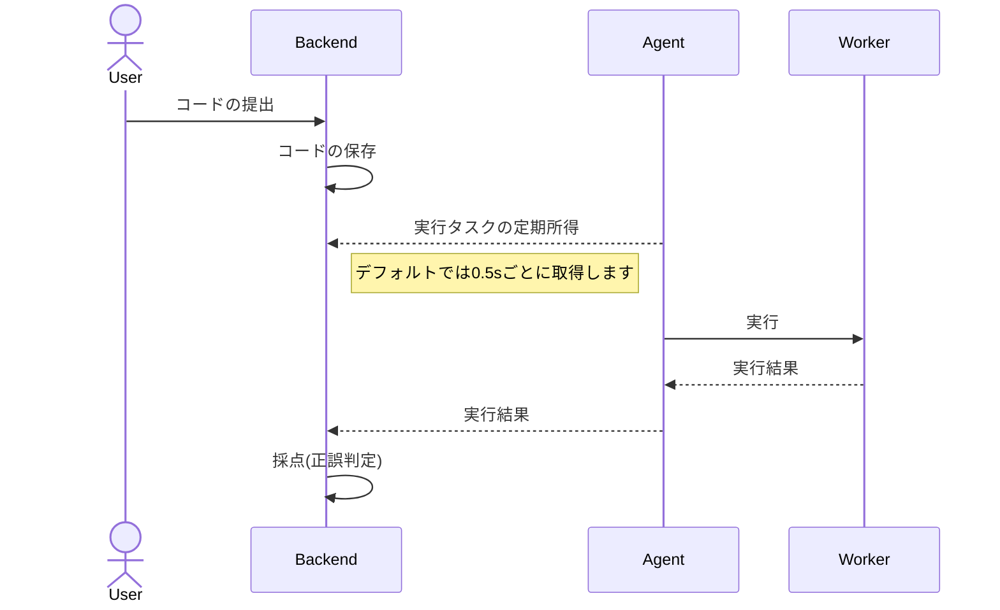

# Structure Document
KOJSv6の構造のドキュメントです。  
2023 June 17th Poporon Network

## 大まかな概要
コードの提出が行われた際のフロー

詳しくはAgent, Workerのリポジトリをご覧ください.
- [poporonnet/jkojs-agent (Agent)](https://github.com/poporonnet/jkojs-agent)
- [poporonnet/jkojs-worker (Worker)](https://github.com/poporonnet/jkojs-worker)
